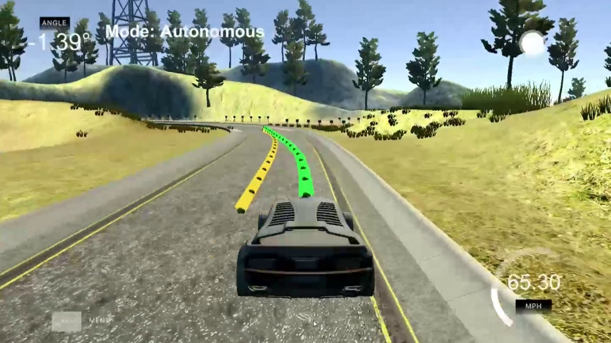

## Model Predictive Control (MPC)

Implements Model Predictive Control to drive the car simulator around the track



---

### References and dependences

* cmake >= 3.5
  * All OSes: [click here for installation instructions](https://cmake.org/install/)
* make >= 4.1(mac, linux), 3.81(Windows)
  * Linux: make is installed by default on most Linux distros
  * Mac: [install Xcode command line tools to get make](https://developer.apple.com/xcode/features/)
  * Windows: [Click here for installation instructions](http://gnuwin32.sourceforge.net/packages/make.htm)
* gcc/g++ >= 5.4
  * Linux: gcc / g++ is installed by default on most Linux distros
  * Mac: same deal as make - [install Xcode command line tools]((https://developer.apple.com/xcode/features/)
  * Windows: recommend using [MinGW](http://www.mingw.org/)
* [uWebSockets](https://github.com/uWebSockets/uWebSockets)
  * Run either `install-mac.sh` or `install-ubuntu.sh`.
  * If you install from source, checkout to commit `e94b6e1`, i.e.
    ```
    git clone https://github.com/uWebSockets/uWebSockets
    cd uWebSockets
    git checkout e94b6e1
    ```
    Some function signatures have changed in v0.14.x. See [this PR](https://github.com/udacity/CarND-MPC-Project/pull/3) for more details.

* **Ipopt and CppAD:** Please refer to [this document](https://github.com/udacity/CarND-MPC-Project/blob/master/install_Ipopt_CppAD.md) for installation instructions.
* [Eigen](http://eigen.tuxfamily.org/index.php?title=Main_Page). This is already part of the repo so you shouldn't have to worry about it.
* Simulator. You can download these from the [releases tab](https://github.com/udacity/self-driving-car-sim/releases).
* Not a dependency but read the [DATA.md](./DATA.md) for a description of the data sent back from the simulator.

#### For Windows
Unfortunately it could be challengeable to install Ipopt and CppAD natively for Windows. Therefore I suggest [Install the Windows Subsystem for Linux (WSL)](https://docs.microsoft.com/en-us/windows/wsl/install-win10) and follow instructions for Linux to setup all dependences.
To build project I recommend use Visual Studio 2017 [Open Folder project](https://docs.microsoft.com/en-us/cpp/ide/non-msbuild-projects). Please refer to [Targeting the Windows Subsystem for Linux from Visual Studio](https://blogs.msdn.microsoft.com/vcblog/2017/02/08/targeting-windows-subsystem-for-linux-from-visual-studio/) to configure Visual Studio for debugging on WSL. This is option I used myself.

The main program can be built and run by doing the following from the project top directory.

1. mkdir build
2. cd build
3. cmake ..
4. make
5. ./mpc

### Project content
* [CMakeLists.txt](./CMakeLists.txt) - make file.
* [CMakeSettings.json](./CMakeSettings.json) **(Windows only)** - Visual Studio 2017 Open Folder configuration. Includes instructions how to build your project.
* [install-mac.sh](./install-mac.sh) **(Mac only)** - *uWebSockets* installation script for Mac.
* [install-ubuntu.sh](./install-ubuntu.sh) **(Linux only)** - *uWebSockets* installation script for Linux (Ubuntu).
* [install_Ipopt_CppAD.md](./install_Ipopt_CppAD.md) - describes *Ipopt* and *CppAD* installation process.
* [install_ipopt.sh](./install_ipopt.sh) - build and install *Ipopt*.
* [DATA.md](./DATA.md) - describes the JSON object send back from the simulator command server.
* [rebuild.sh](./rebuild.sh) - rebuild this solution.
* [run.sh](./run.sh) - run this solution.
* [images](./images) - folder, images for this document.
* [src](./src) - source code.
* [writeup.md](./writeup.md) – project description in details.
* [video.mp4](./video.mp4) – video-report (one track circle with best parameters).

#### Source code

* [main.cpp](./src/main.cpp) - Main class, starts web-service to process sensors data from simulator, prepare data (vehicle position, velocity, effective control values, target trajectory), pass it to MPC class and pass updated control values back to simulator. Additionally it pass information which helps simulator visualize target path and predicted vehicle trajectory.
* [MPC.h](./src/MPC.h), [MPC.cpp](./src/MPC.cpp) - MPC implementation.
* [Eigen](./src/Eigen) - Eigen math library.
